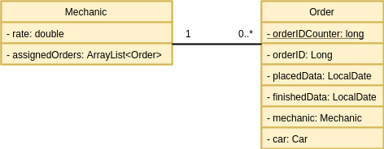
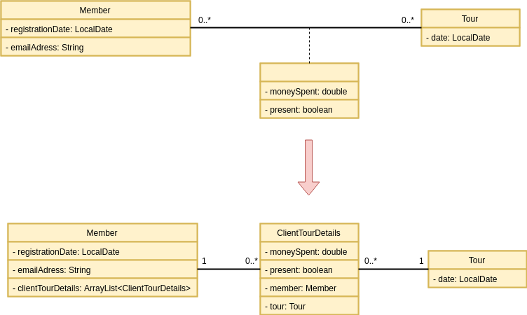
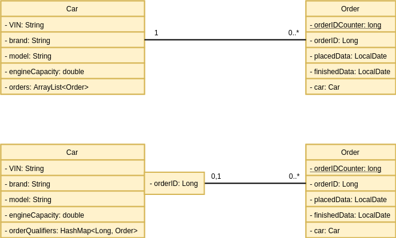
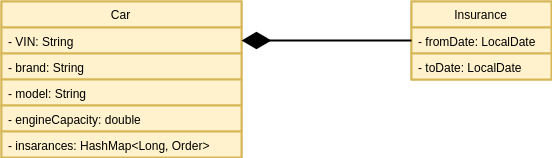

# UML Associations

Mapping UML Associations into Java Code.

## Binary association one to many

Association is implemented with the single reference and container.
Also automatic creation of a reverse connection has been provided.

## Association with attribute
Example based on tour company business process.

There is no construction in Java that provide implementation belowe diagraw by default.  

Well as you can see above additional class was created. 
It contains references to associated classes and association attribute data. 

## Qualified association
Example based on car workshop workflow.

To get order with specific id we need to take car orders from the container one by one and check every id.

To accelerate program we use qualifiers. We have Map instead of simple container.

## Composition

The simplest way to implement composition in Java is to use nested class. This mechanism profide following features:
- Inner class object can't exist without outer class object.
- Inner class object has access to the outer class invariants.

